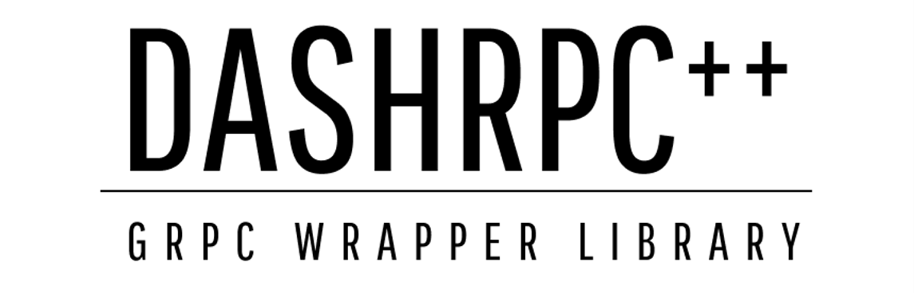

# DASHRPC



This library is an implementation of the Dash *.proto files. It allows to do GRPC and uses the nlohmann library for JSON files. There is only the option to build from source. This library is not officially supported by the Dash.

It was developed to create stress testing for the Dash network. There is no guarantee that it will work for you

*(。﹏。*)*

## Building

First of all, one has to clone the project from github. The repository is using submodules, however, those are handled in the next step. Now recursively update and init. the submodules, otherwise one will run into an error.

```bash
# clone the repository and be recursively update the submodules
git clone https://github.com/jctemp/dashrpc
cd dashrpc

# recursively update submodule Catch2 => required and no conan dep
git submodule update --init --recursive extern/Catch2 extern/platform

# recursively update submodules if you not want to use conan
git submodule update --init --recursive
```

After one has cloned the repository and took care of the submodules, one perpare the directory to build the library. If you want to adjust building parameters see [cmake.org](https://cmake.org/cmake/help/latest/manual/cmake.1.html).

```bash
# 1. create build directory
mkdir build

# 1.1. if you want to use conan
cd build && conan install .. && cd ..

# 2. generate project build system
cmake --no-warn-unused-cli -S$(pwd) -B$(pwd)/build -D ENABLE_DASHRPC_CONAN=ON -D ENABLE_DASHRPC_TESTING=ON 

# 2.1. if you want to use conan
-D ENABLE_DASHRPC_CONAN=ON 

# 2.2. enable test if wanted
-D ENABLE_DASHRPC_TESTING=ON 

# 3. build the project
#
# This part can take a lot of time due to the size of the grpc project.
# If you have pre-compiled grpc, then link agaist it manually or alternatively
# use the conan package manager by enabling it in the configuration.
#
# Took about 30min on WSL Debian 10 with gcc 10.2.1 and Ryzen 7 5800x building
# for Release.
#
# ┌──────────────────────────────┬───────────────────────┐
# │   cmake                      │                       │
# │     --build build            │ build directory       │
# │     --config [Debug|Release] │ build variant         │
# │     --parallel n             │ number of jobs        │
# │     --clean-first            │ clean build artefacts │
# └──────────────────────────────┴───────────────────────┘

NUM_JOBS=$(nproc)
CONFIG=Release            # Debug
TARGET=dashrpc            # only library
TARGET=dashrpc_unit_tests # unit_tests
cmake --build build --config ${CONFIG} --parallel ${NUM_JOBS} --clean-first --target ${TARGET}

# executables and libraries are found under build/bin and build/lib
cd ./build/bin
cd ./build/lib
./build/bin/dashrpc_unit_tests


```
